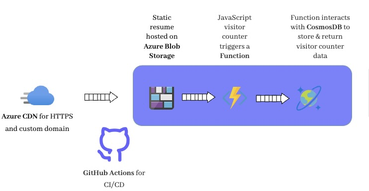

# Status
[](https://github.com/sohailsajid79/azure-resume/actions/workflows/frontend.main.yml)
[](https://github.com/sohailsajid79/azure-resume/actions/workflows/backend.main.yml)

# Azure Resume

This project demonstrates how to build and host a resume on Azure using Blob Storage, Functions, CosmosDB, and GitHub Actions for CI/CD.



## Overview

This project leverages various Azure services to create a dynamic, scalable, and serverless application for hosting a resume with a visitor counter.

## Features
- **Static Hosting**: The resume is hosted as a static website on Azure Blob Storage.
- **Visitor Counter**: A JavaScript-based counter tracks visitors and updates the count using Azure Functions and CosmosDB.
- **Continuous Deployment**: GitHub Actions automate the deployment process.

## Components

### Azure CDN and Blob Storage

- **Azure CDN**: Provides HTTPS and custom domain support for the static resume.
- **Azure Blob Storage**: Hosts the static resume files.

### Visitor Counter

- **JavaScript Function**: The `main.js` file contains the logic for the visitor counter. It triggers an Azure Function call to update and retrieve the visitor count from CosmosDB.

- **Azure Function**: Interacts with CosmosDB to update and retrieve visitor data.

### Database

- **CosmosDB**: Stores the visitor counter data in a highly available and scalable database.

### CI/CD

- **GitHub Actions**: Automates the build and deployment process.

## Setup Instructions

### Prerequisites

- Azure account
- GitHub account
- Node.js installed locally
- VSCode or another code editor

### Steps

1. **Clone the Repository**
   ```sh
   git clone https://github.com/sohailsajid79/azure-resume.git
   cd azure-resume

2. **Setup Azure Blob Storage**
    - Create a storage account and a blob container in the Azure portal.
    - Upload your static resume files to the blob container.

3. **Configure Azure CDN**
    - Link the CDN to your blob storage to enable HTTPS and custom domain support.

4. **Setup CosmosDB**
    - Create a CosmosDB account and a new database.
    - Create a container within the database to store the visitor count.

5. **Create Azure Function**
    - In VSCode, use the Azure Functions extension to create a new function app.
    - Add a new HTTP-triggered function to interact with CosmosDB.

6. **Bind CosmosDB to Azure Function**
    - Configure input and output bindings in the function to read from and write to the CosmosDB container.

7. **Configure GitHub Actions**
    - Set up GitHub Actions workflow files (.github/workflows/) to automate the deployment process for frontend and backend.
    - Ensure secrets (e.g., Azure credentials) are stored in GitHub for authentication.

8. **Deploy the Application**
    - Push your changes to GitHub.
    - GitHub Actions will trigger the workflow and deploy your application to Azure.
